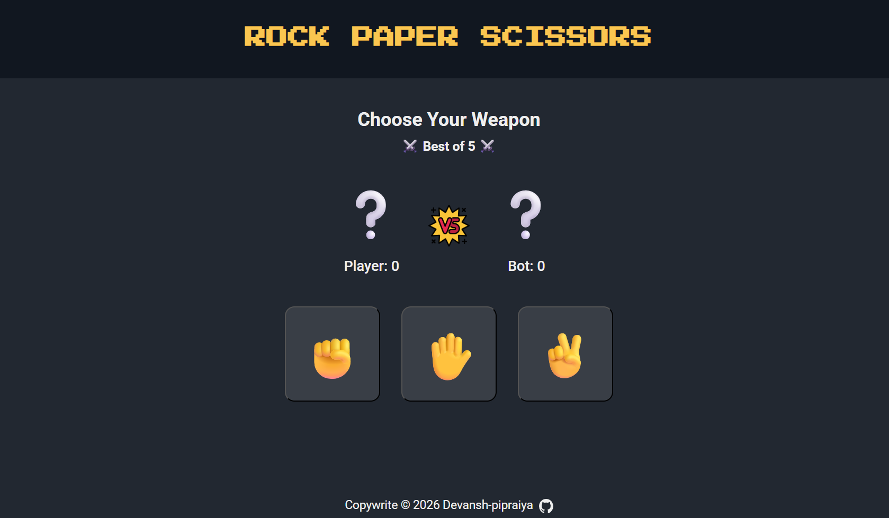

# 🎮 Interactive Rock Paper Scissors 👋

### Classic game with a clean, modern UI — evolved from a console-only version

This project focuses on building **clear game logic** & **user interaction** built using HTML, CSS & JavaScript, 

Play against the bot with **simple button choices** and **instant visual feedback**.

---

 📌 **Project status:** Completed ✅ | 🌐 [Live Preview](https://devansh-pipraiya.github.io/rock-paper-scissors-js/) 

---

## ✨ Features

- 👤 **Player vs Bot** — with random bot moves to keep it fair and fun
  
- 🖱️ **Interactive Buttons** — just click ✊ Rock, ✋ Paper, or ✌ Scissors
  
- 📊 **Live Updates** — scores, choices, and round results show instantly
  
- 🎮 **Best of 5** — plays 5 rounds then declares the winner
  
- 🖥️ **Console Logs** — original styled outputs from original version (check dev tools)
  
- 🔄 **Play Again** — one click to reset and start fresh
  

## Preview 👀

---

## 📚 What I Learned

- **JavaScript Basics**: Function scope, structure, conditionals (`if/else`, `switch`), loops, and random generation.
  
- **User Input Handling**: Evolved from prompts to **interactive buttons** using **event listeners**.
  
- **DOM Manipulation**: Querying elements, updating content, and class toggles for animations.
  
- **UI Integration**: Combining logic with HTML/CSS for clean visual feedback while preserving console elements.
  
- **Clean Code Practices**: used clear names, short functions, and comments to make everything easy to follow
  

---

### 🔨 Future Improvements / To-Do

- [x] Add graphical UI with clickable buttons.
- [x] Display results and scores on the webpage.
- [x] Add a replay/reset option.
- [x] Add animations for wins/losses/ties.
- [ ] Add sound effects
- [ ] Make rounds customizable (e.g., best of 3/7).

---

## ⌛ Project Evolution

This project was originally a pure console-based Rock Paper Scissors game (using prompts and console output).  
Now its a full interactive browser game

> The original console logs remain active for anyone curious — just open DevTools while playing.  
> To check v1.0 click on `main branch and then **v1.0** under the tag tab` — that's the classic console-only version.

## Console Preview 👀

### Gameplay Demo

