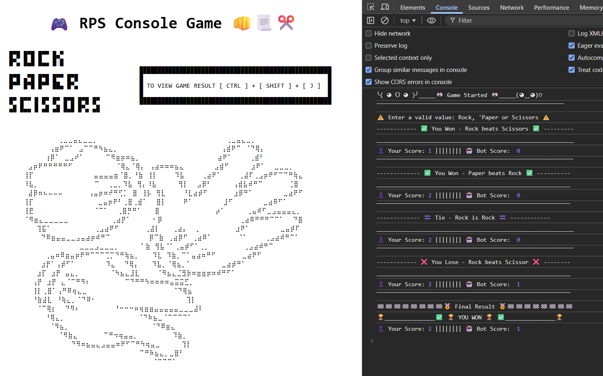
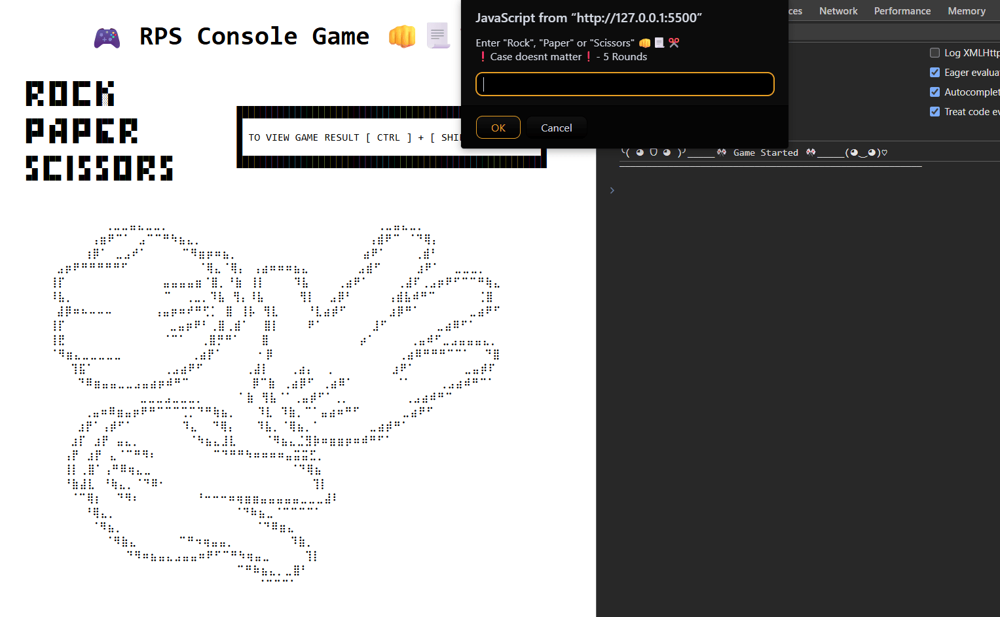

# 🎮 Rock Paper Scissors (RPS) 👊📃✂️ 

### A browser-based implementation of the classic Rock Paper Scissors game.

This project focuses on building **clear game logic** and **user interaction** using JavaScript,

The game runs in the browser **console** and uses standard **RPS rules** for determining **outcomes.**

---
> 📌 **Project status:** Completed ✅ | 🌐 [Live Preview](https://devansh-pipraiya.github.io/rock-paper-scissors-js/)
---

## Preview 👀

### Screenshot

### Gameplay Demo

## ✨ Features

- 👤 **Player VS computer** — classic one-on-one RPS  
- 🎮 **5-round match format** — keeps the game short and focused   
- 🎲 **Randomize moves of Computer** — no predictable patterns  
- ⚖️ **Clear win, loss & draw logic** — based on standard RPS rules   
- 📊 **Score tracking per round** — see who’s actually winning  
- 🆎 **Case-insensitive input** — (Rock, rock, ROCK all work)   
- 🖥️ **Console-driven gameplay** — everything happens inside browser console

## 📚 What I Learned 

- **JavaScript function** structure and **scope**

- **Conditional** logic using `if / else` and `switch`
  
- **Loop** control with `for` loops
  
- Handling user input and **case-insensitive values**
  
- Writing **cleaner** and more **readable** **console** **output**

## 🎮 How to Play 

1. Run the website using [Live Preview Link](https://devansh-pipraiya.github.io/rock-paper-scissors-js/) or Live Server (vscode).

3. You will be prompted **5 times** to enter your choice.
   
5. Enter- **Rock**, **Paper**, or **Scissors** (input is case-insensitive so rock, ROck all works ).
   
7. To view the Score/Result press `Ctrl + Shift + j` to open browser console.